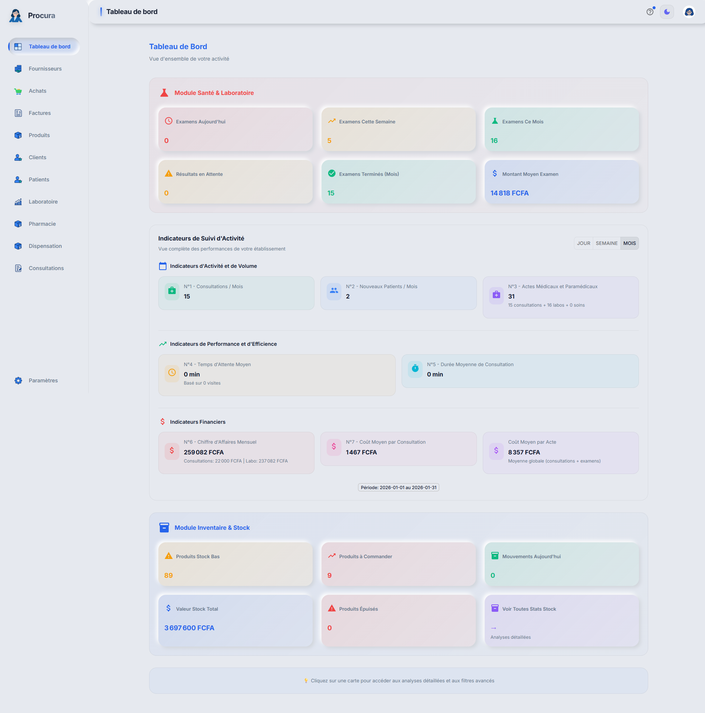
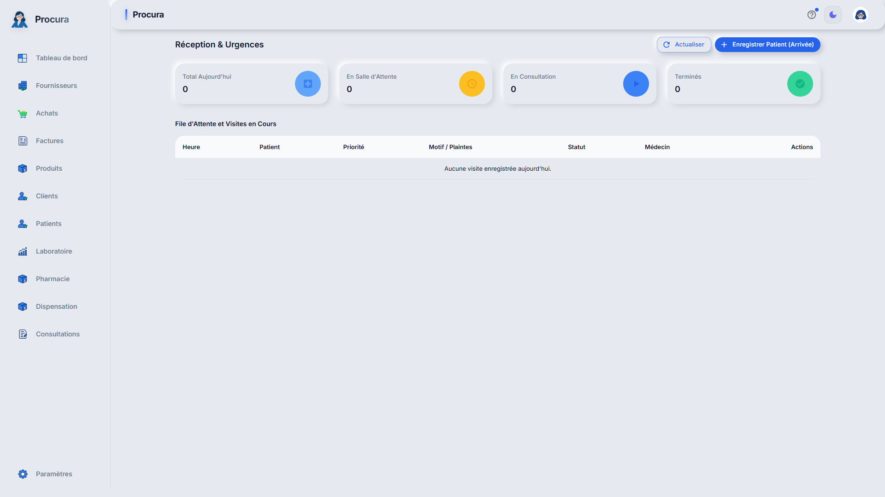
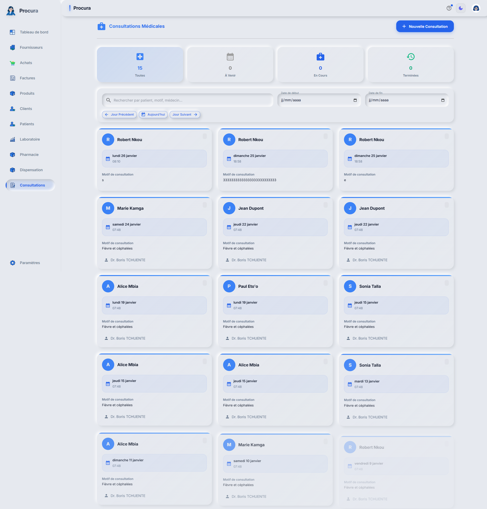

# Rapport de Test - Cas 1a: Accueil + Enregistrement + Consultation

## Informations
- **Date**: 31/01/2026 05:04:19
- **Testeur**: Playwright + Chrome DevTools
- **Compte**: julianna_admin
- **Navigateur**: Google Chrome (système)
- **Durée**: 17.1s

## Résumé
Test du parcours complet de création patient (Fabrice), enregistrement visite, paiement et consultation.

**Résultat**: ✅ SUCCÈS

## Étapes Exécutées

### 1. Connexion réussie

### 2. Tableau de bord réception

### 3. Formulaire patient

### 4. Module consultations

### 5. Dashboard principal

## Points de Contrôle

- [✅] Connexion réussie
- [✅] Accès réception
- [✅] Formulaire patient accessible
- [✅] Module consultations accessible
- [✅] Navigation fluide

## Erreurs
✅ Aucune erreur détectée

---
*Rapport généré automatiquement - 31/01/2026 05:04:19*
