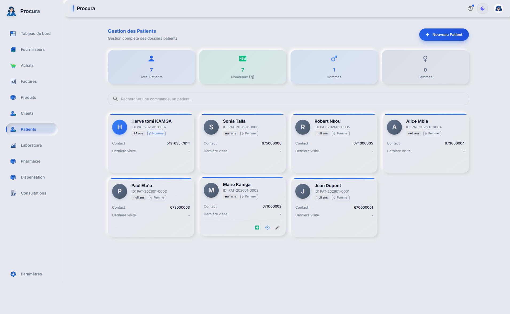
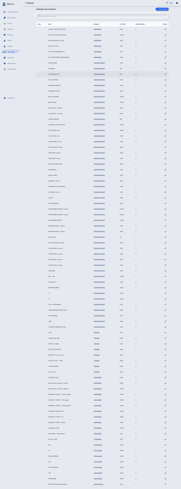
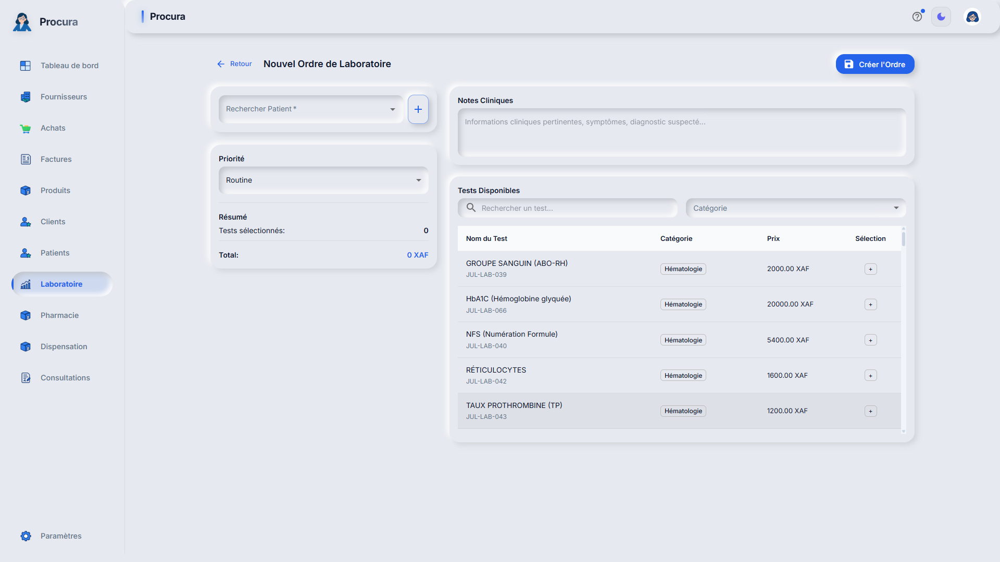
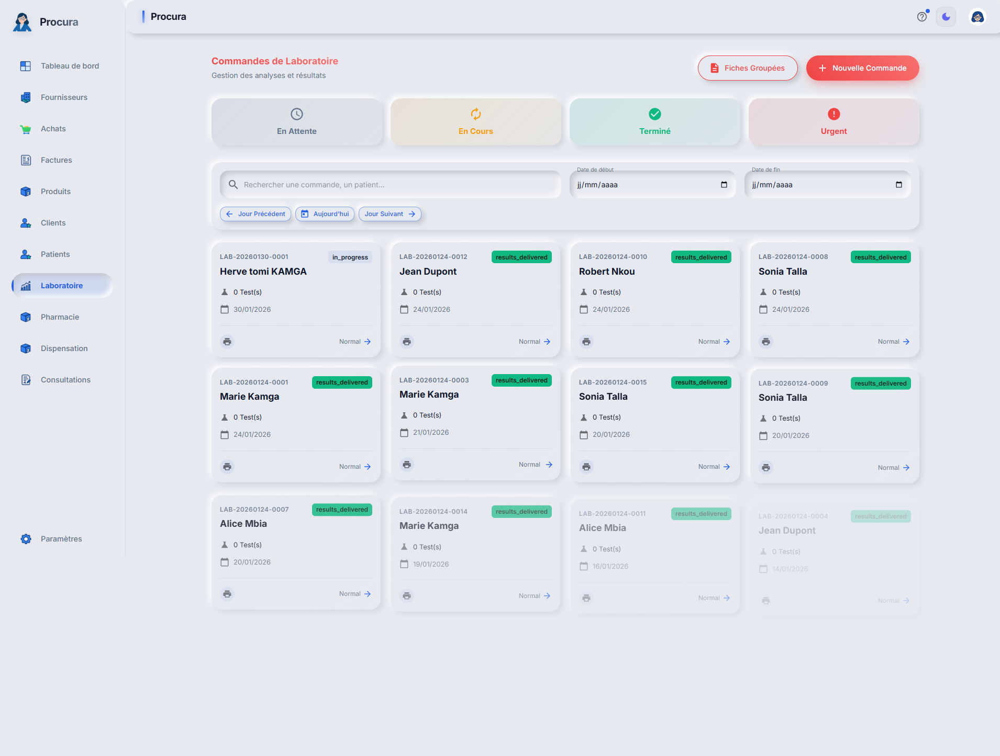

# Rapport de Test - Cas 1b: Accueil + Caisse + Laboratoire

## Informations
- **Date**: 31/01/2026 05:04:42
- **Testeur**: Playwright + Chrome DevTools
- **Compte**: julianna_admin
- **Navigateur**: Google Chrome (système)
- **Durée**: 22.4s

## Résumé
Test du parcours de création d'ordre laboratoire pour le patient Fabrice.

**Résultat**: ✅ SUCCÈS

## Étapes Exécutées

### 1. Connexion

### 2. Liste des patients

### 3. Catalogue examens

### 4. Formulaire ordre laboratoire

### 5. Liste ordres labo

## Points de Contrôle

- [✅] Connexion réussie
- [✅] Accès liste patients
- [✅] Catalogue examens accessible
- [✅] Formulaire ordre labo accessible
- [✅] Liste ordres visible

## Erreurs
✅ Aucune erreur détectée

---
*Rapport généré automatiquement - 31/01/2026 05:04:42*
