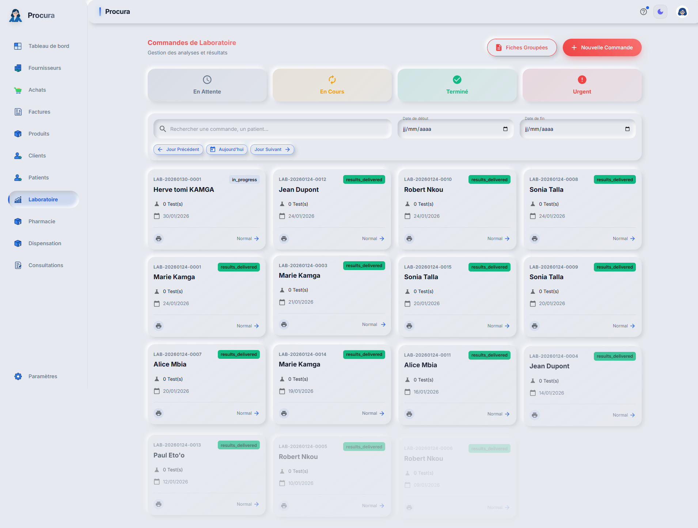

# Rapport de Test - Cas 1c: Récupération Résultats

## Informations
- **Date**: 31/01/2026 05:04:58
- **Testeur**: Playwright + Chrome DevTools
- **Compte**: julianna_admin
- **Navigateur**: Google Chrome (système)
- **Durée**: 16.3s

## Résumé
Test du parcours de récupération des résultats d'examens pour Fabrice.

**Résultat**: ✅ SUCCÈS

## Étapes Exécutées

### 1. Connexion

### 2. Liste ordres labo

### 3. Catalogue examens disponibles

## Points de Contrôle

- [✅] Connexion réussie
- [✅] Accès ordres labo
- [✅] Catalogue visible

## Erreurs
✅ Aucune erreur détectée

---
*Rapport généré automatiquement - 31/01/2026 05:04:58*
