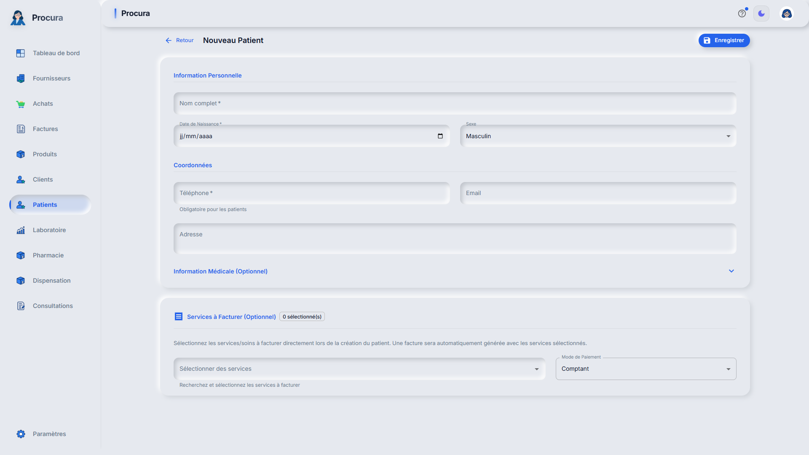
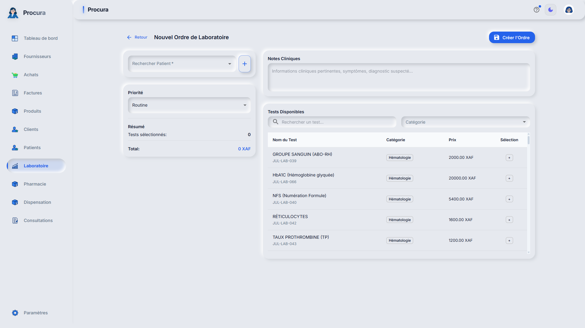

# Rapport de Test - Cas 2: Patient Externe pour Examens

## Informations
- **Date**: 31/01/2026 05:05:39
- **Testeur**: Playwright + Chrome DevTools
- **Compte**: julianna_admin
- **Navigateur**: Google Chrome (système)
- **Durée**: 14.0s

## Résumé
Test du parcours patient externe (Angel) venant pour examens de laboratoire uniquement.

**Résultat**: ✅ SUCCÈS

## Étapes Exécutées

### 1. Connexion

### 2. Formulaire patient externe Angel

### 3. Ordre laboratoire patient externe

## Points de Contrôle

- [✅] Connexion réussie
- [✅] Formulaire patient accessible
- [✅] Ordre labo sans consultation

## Erreurs
✅ Aucune erreur détectée

---
*Rapport généré automatiquement - 31/01/2026 05:05:39*
