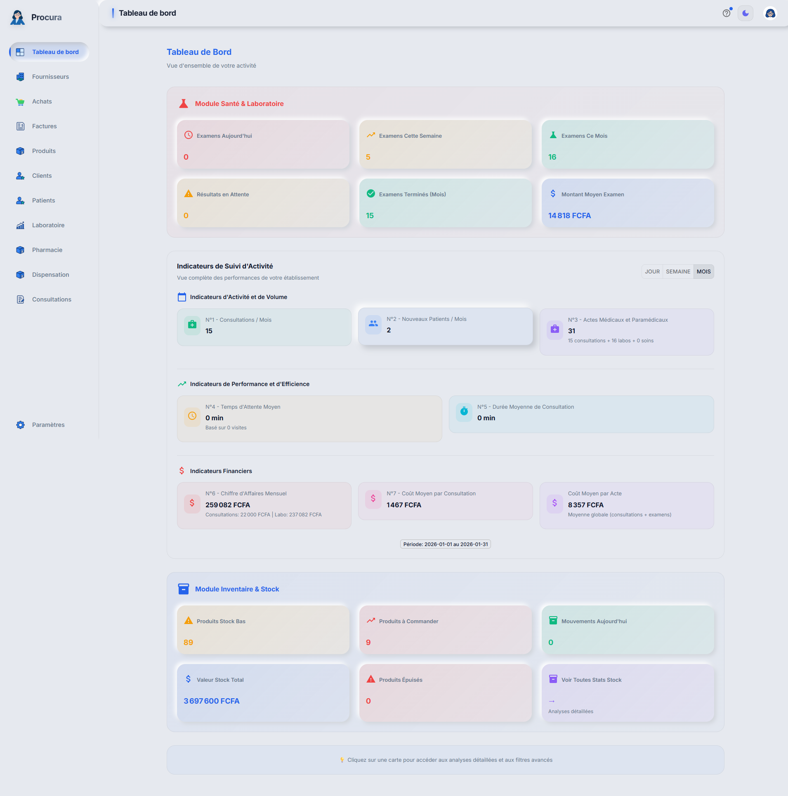
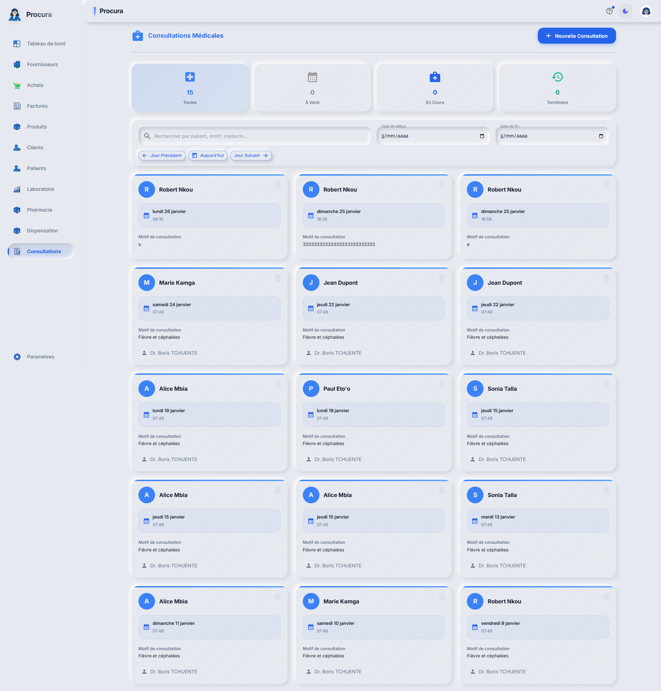
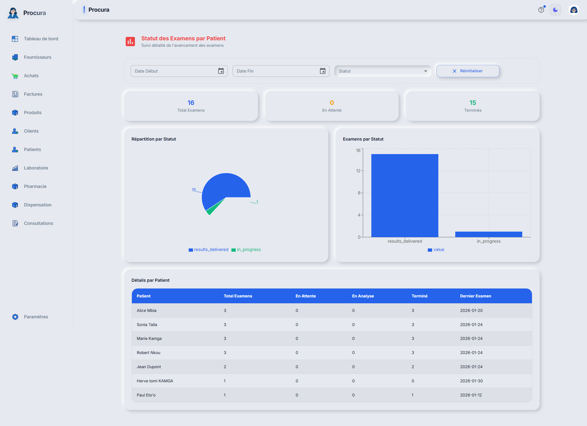

# Rapport de Test - Cas 6: Consultation Historique par Médecin

## Informations
- **Date**: 31/01/2026 05:05:54
- **Testeur**: Playwright + Chrome DevTools
- **Compte**: julianna_admin
- **Navigateur**: Google Chrome (système)
- **Durée**: 13.9s

## Résumé
Test de consultation de l'historique médical complet du patient Fabrice par le médecin.

**Résultat**: ✅ SUCCÈS

## Étapes Exécutées

### 1. Connexion

### 2. Liste patients

### 3. Historique consultations

### 4. Analytique santé

## Points de Contrôle

- [✅] Connexion réussie
- [✅] Accès liste patients
- [✅] Historique consultations accessible
- [✅] Analytique accessible

## Erreurs
✅ Aucune erreur détectée

---
*Rapport généré automatiquement - 31/01/2026 05:05:54*
