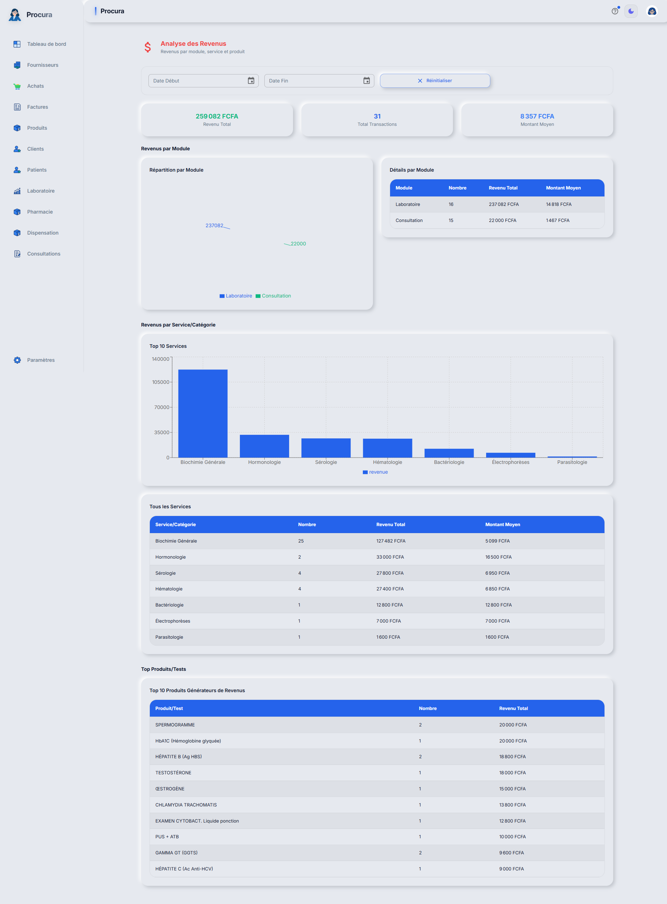
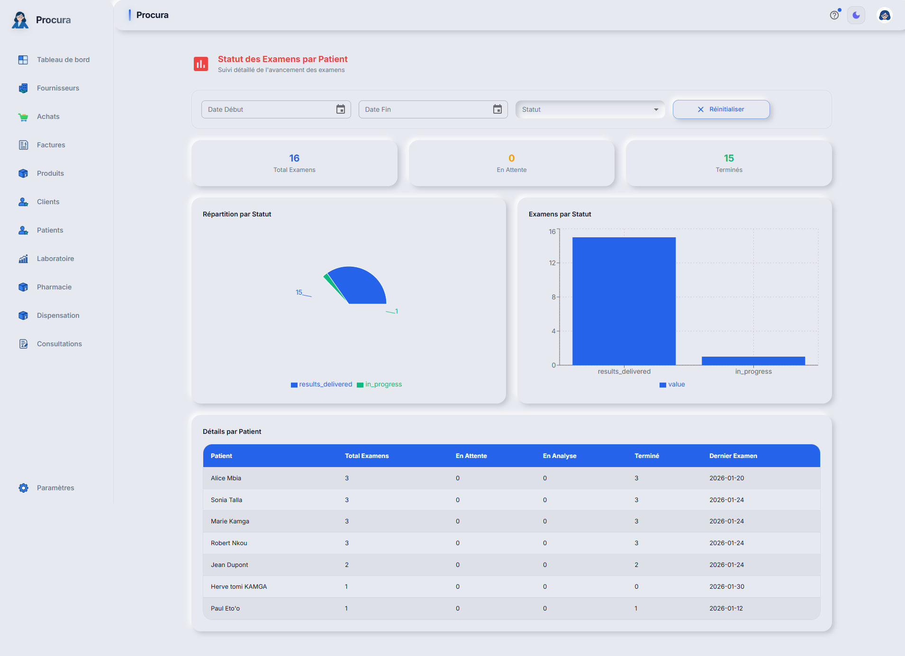

# Rapport de Test - Cas 7: Patient Demande Son Historique

## Informations
- **Date**: 31/01/2026 05:06:08
- **Testeur**: Playwright + Chrome DevTools
- **Compte**: julianna_admin
- **Navigateur**: Google Chrome (système)
- **Durée**: 13.8s

## Résumé
Test de génération et export de l'historique médical complet pour le patient Fabrice.

**Résultat**: ✅ SUCCÈS

## Étapes Exécutées

### 1. Connexion

### 2. Analytique revenus

### 3. Analytique examens

## Points de Contrôle

- [✅] Connexion réussie
- [✅] Analytique revenus accessible
- [✅] Analytique examens accessible

## Erreurs
✅ Aucune erreur détectée

---
*Rapport généré automatiquement - 31/01/2026 05:06:08*
