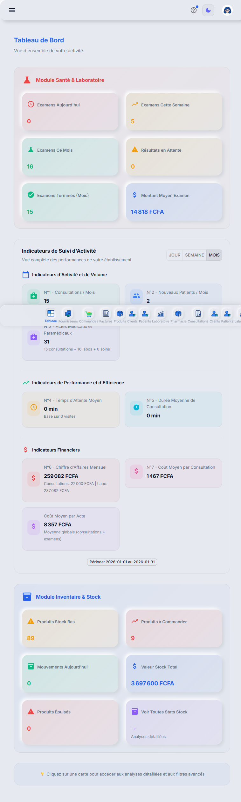
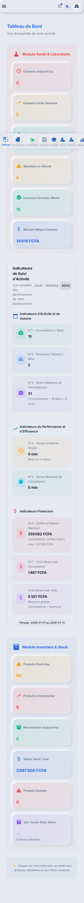
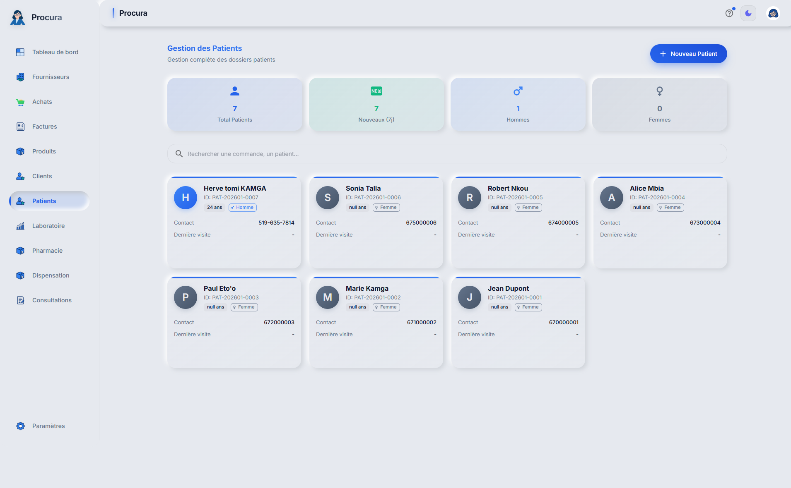
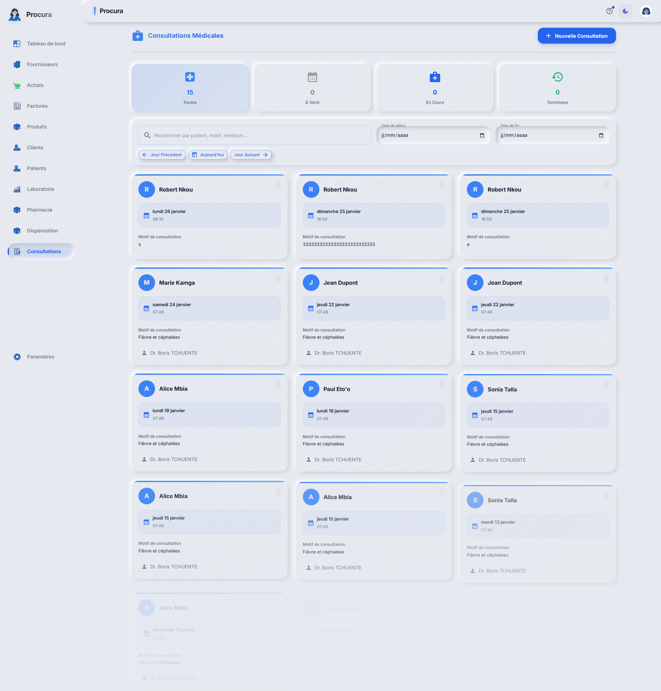
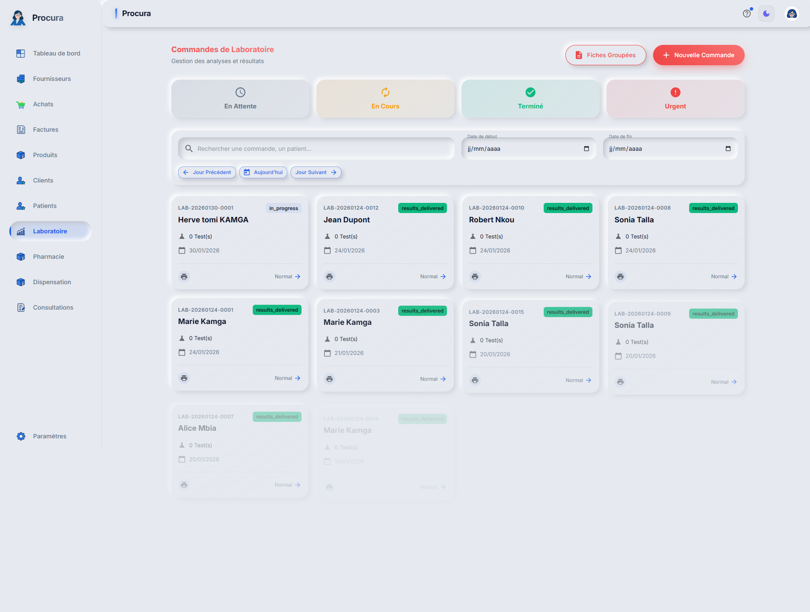
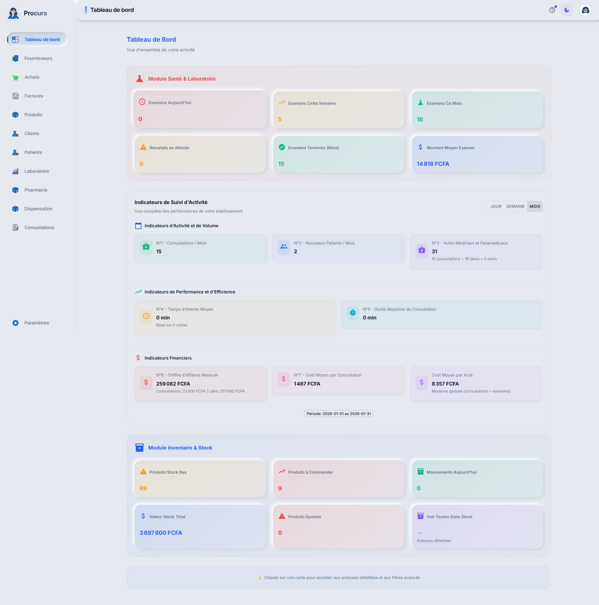
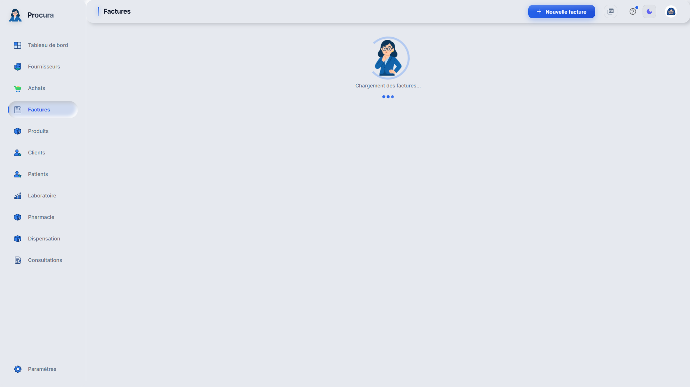
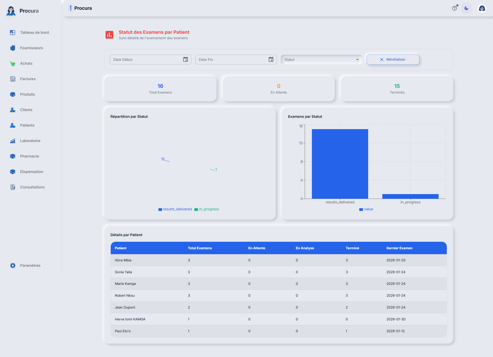

# Test Module Dashboard - Rapport Détaillé

## Informations Générales
- **Date**: 31/01/2026 05:16:09
- **Module**: Dashboard Principal
- **URL**: http://localhost:3000
- **Compte**: julianna_admin
- **Navigateur**: Google Chrome
- **Durée du test**: 31.1s

## Vue d'Ensemble
Le module Dashboard est la page d'accueil de l'application ProcureGenius.
Ce test vérifie toutes les fonctionnalités disponibles, les widgets, et l'accessibilité.

## Screenshots du Module

### 1. Connexion réussie

### 2. Dashboard principal - Vue complète

### 3. 24 Widgets/Cards visibles

### 4. Vue tablette (768px)

### 5. Vue mobile (375px)

### 6. Navigation vers Patients

### 7. Navigation vers Consultations

### 8. Navigation vers Laboratoire

### 9. Navigation vers Pharmacie

### 10. Navigation vers Factures

### 11. Navigation vers Analytique

### 12. Dashboard - Vue finale

## Analyse Détaillée

### Section 1: Dashboard Principal

**Éléments Visibles:**
- buttons: 22
- cards: 24
- images: 42

**Composants Interactifs:**
- Navigation Menu: 1
- Header: 1

**Titres/Sections:**
- "Tableau de Bord"

## Fonctionnalités Testées

✅ **Accès au dashboard**
   - Page dashboard accessible et chargée correctement

❌ **Menu de navigation**
   - 0 liens de navigation disponibles

✅ **Widgets statistiques**
   - 24 widgets affichés sur le dashboard

❌ **Graphiques/Charts**
   - 0 graphiques affichés

❌ **Tableaux de données**
   - 0 tableaux affichés

✅ **Boutons interactifs**
   - 22 boutons disponibles

❌ **Fonction de recherche**
   - Pas de recherche visible

✅ **Notifications**
   - Aucune notification active

❌ **Menu profil utilisateur**
   - Menu profil non trouvé

✅ **Interface responsive**
   - Interface s'adapte aux différentes tailles d'écran

✅ **Accès module Patients**
   - Module accessible via /healthcare/patients

✅ **Accès module Consultations**
   - Module accessible via /healthcare/consultations

✅ **Accès module Laboratoire**
   - Module accessible via /healthcare/laboratory

✅ **Accès module Pharmacie**
   - Module accessible via /healthcare/pharmacy

✅ **Accès module Factures**
   - Module accessible via /invoices

✅ **Accès module Analytique**
   - Module accessible via /healthcare/analytics

## Erreurs
✅ Aucune erreur détectée

## Recommandations

- **Fonctionnalités testées**: 16
- **Fonctionnelles**: 11 (68.8%)
- **Screenshots capturés**: 12

❌ Le module Dashboard présente des problèmes importants.

---
*Test automatisé avec Playwright - 31/01/2026 05:16:09*
