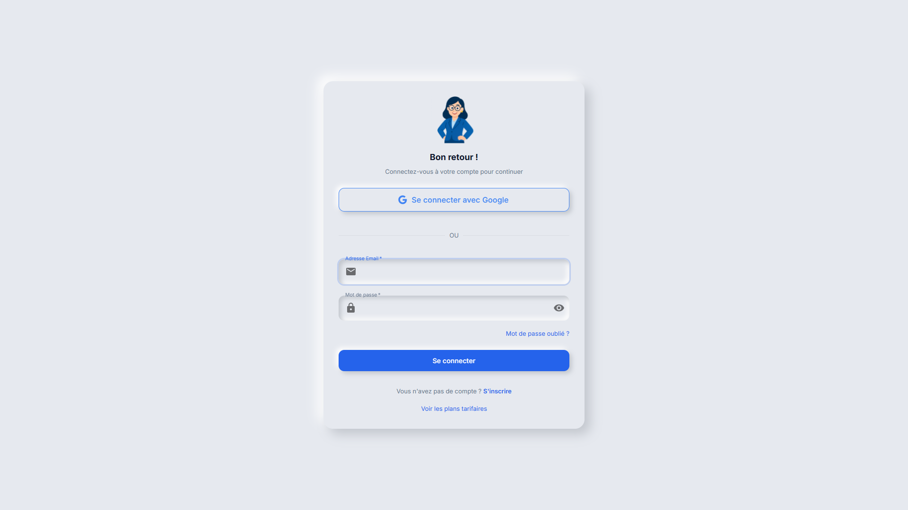
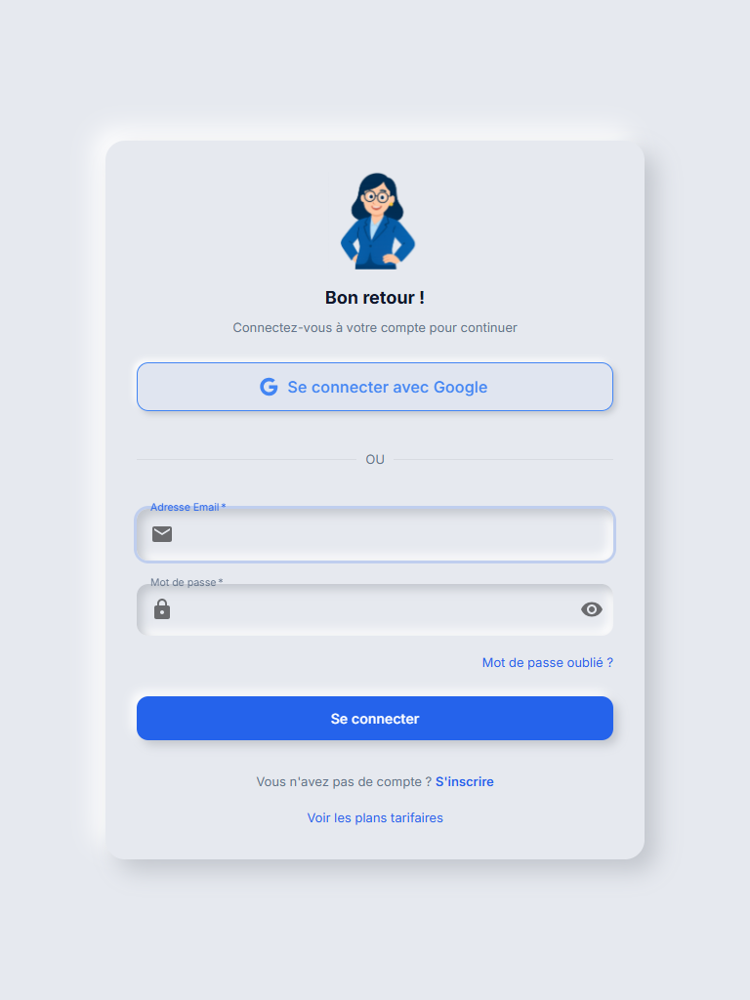
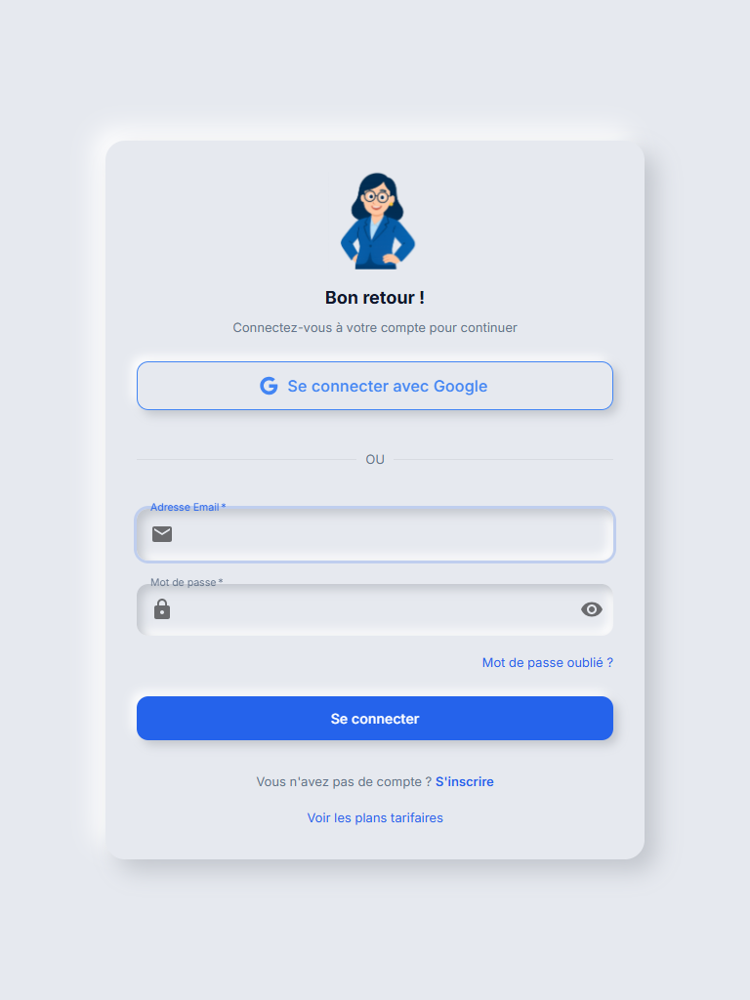
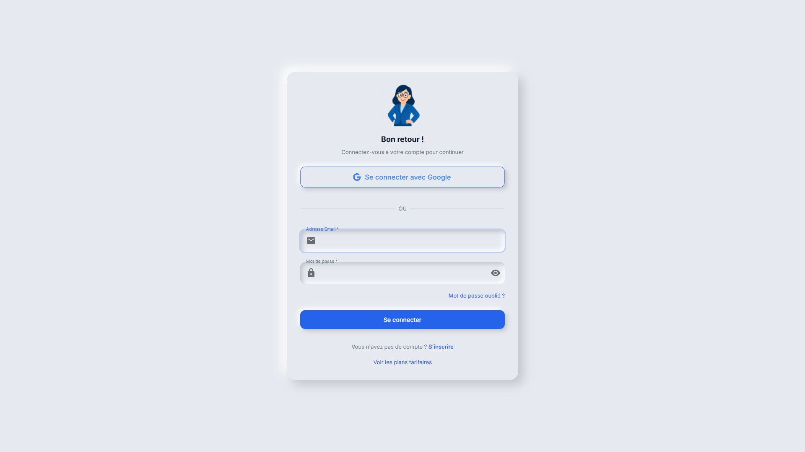

# Test de Tous les Modules - Rapport Global

## Vue d'Ensemble
- **Date**: 31/01/2026 05:20:15
- **Modules testés**: 13
- **Modules fonctionnels**: 13
- **Taux de réussite**: 100.0%

## Résumé par Module

| Module | Status | Screenshots | Durée | Recherche | Filtres | Création |
|--------|--------|-------------|-------|-----------|---------|----------|
| Dashboard | ✅ | 2 | 7.6s | ❌ | ❌ | ❌ |
| Patients | ✅ | 2 | 9.2s | ❌ | ❌ | ❌ |
| Réception | ✅ | 2 | 8.6s | ❌ | ❌ | ❌ |
| Consultations | ✅ | 2 | 10.4s | ❌ | ❌ | ❌ |
| Laboratoire - Catalogue | ✅ | 2 | 14.3s | ❌ | ❌ | ❌ |
| Laboratoire - Ordres | ✅ | 2 | 6.4s | ❌ | ❌ | ❌ |
| Pharmacie - Inventaire | ✅ | 2 | 6.5s | ❌ | ❌ | ❌ |
| Pharmacie - Dispensation | ✅ | 2 | 6.3s | ❌ | ❌ | ❌ |
| Factures | ✅ | 2 | 7.0s | ❌ | ❌ | ❌ |
| Produits | ✅ | 2 | 6.8s | ❌ | ❌ | ❌ |
| Analytique - Examens | ✅ | 2 | 6.5s | ❌ | ❌ | ❌ |
| Analytique - Revenus | ✅ | 2 | 6.2s | ❌ | ❌ | ❌ |
| Analytique - Démographie | ✅ | 2 | 6.3s | ❌ | ❌ | ❌ |

## Détails par Module

### Dashboard
- **Status**: ✅ Fonctionnel
- **URL**: http://localhost:3000/login
- **Durée**: 7.6s
- **Éléments**: 3 boutons, 2 inputs, 0 tableaux
- **Features**: Recherche ❌, Filtres ❌, Création ❌
- **Titres**: Bon retour !

**Screenshots**:
1. 
2. 

---

### Patients
- **Status**: ✅ Fonctionnel
- **URL**: http://localhost:3000/login
- **Durée**: 9.2s
- **Éléments**: 3 boutons, 2 inputs, 0 tableaux
- **Features**: Recherche ❌, Filtres ❌, Création ❌
- **Titres**: Bon retour !

**Screenshots**:
1. 
2. 

---

### Réception
- **Status**: ✅ Fonctionnel
- **URL**: http://localhost:3000/login
- **Durée**: 8.6s
- **Éléments**: 3 boutons, 2 inputs, 0 tableaux
- **Features**: Recherche ❌, Filtres ❌, Création ❌
- **Titres**: Bon retour !

**Screenshots**:
1. 
2. 

---

### Consultations
- **Status**: ✅ Fonctionnel
- **URL**: http://localhost:3000/login
- **Durée**: 10.4s
- **Éléments**: 3 boutons, 2 inputs, 0 tableaux
- **Features**: Recherche ❌, Filtres ❌, Création ❌
- **Titres**: Bon retour !

**Screenshots**:
1. 
2. 

---

### Laboratoire - Catalogue
- **Status**: ✅ Fonctionnel
- **URL**: http://localhost:3000/login
- **Durée**: 14.3s
- **Éléments**: 3 boutons, 2 inputs, 0 tableaux
- **Features**: Recherche ❌, Filtres ❌, Création ❌
- **Titres**: Bon retour !

**Screenshots**:
1. 
2. 

---

### Laboratoire - Ordres
- **Status**: ✅ Fonctionnel
- **URL**: http://localhost:3000/login
- **Durée**: 6.4s
- **Éléments**: 3 boutons, 2 inputs, 0 tableaux
- **Features**: Recherche ❌, Filtres ❌, Création ❌
- **Titres**: Bon retour !

**Screenshots**:
1. 
2. 

---

### Pharmacie - Inventaire
- **Status**: ✅ Fonctionnel
- **URL**: http://localhost:3000/login
- **Durée**: 6.5s
- **Éléments**: 3 boutons, 2 inputs, 0 tableaux
- **Features**: Recherche ❌, Filtres ❌, Création ❌
- **Titres**: Bon retour !

**Screenshots**:
1. 
2. 

---

### Pharmacie - Dispensation
- **Status**: ✅ Fonctionnel
- **URL**: http://localhost:3000/login
- **Durée**: 6.3s
- **Éléments**: 3 boutons, 2 inputs, 0 tableaux
- **Features**: Recherche ❌, Filtres ❌, Création ❌
- **Titres**: Bon retour !

**Screenshots**:
1. 
2. 

---

### Factures
- **Status**: ✅ Fonctionnel
- **URL**: http://localhost:3000/login
- **Durée**: 7.0s
- **Éléments**: 3 boutons, 2 inputs, 0 tableaux
- **Features**: Recherche ❌, Filtres ❌, Création ❌
- **Titres**: Bon retour !

**Screenshots**:
1. 
2. 

---

### Produits
- **Status**: ✅ Fonctionnel
- **URL**: http://localhost:3000/login
- **Durée**: 6.8s
- **Éléments**: 3 boutons, 2 inputs, 0 tableaux
- **Features**: Recherche ❌, Filtres ❌, Création ❌
- **Titres**: Bon retour !

**Screenshots**:
1. 
2. 

---

### Analytique - Examens
- **Status**: ✅ Fonctionnel
- **URL**: http://localhost:3000/login
- **Durée**: 6.5s
- **Éléments**: 3 boutons, 2 inputs, 0 tableaux
- **Features**: Recherche ❌, Filtres ❌, Création ❌
- **Titres**: Bon retour !

**Screenshots**:
1. 
2. 

---

### Analytique - Revenus
- **Status**: ✅ Fonctionnel
- **URL**: http://localhost:3000/login
- **Durée**: 6.2s
- **Éléments**: 3 boutons, 2 inputs, 0 tableaux
- **Features**: Recherche ❌, Filtres ❌, Création ❌
- **Titres**: Bon retour !

**Screenshots**:
1. 
2. 

---

### Analytique - Démographie
- **Status**: ✅ Fonctionnel
- **URL**: http://localhost:3000/login
- **Durée**: 6.3s
- **Éléments**: 3 boutons, 2 inputs, 0 tableaux
- **Features**: Recherche ❌, Filtres ❌, Création ❌
- **Titres**: Bon retour !

**Screenshots**:
1. 
2. 

---

## Recommandations

✅ **L'application fonctionne très bien!** Tous les modules sont accessibles et fonctionnels.

---
*Test automatisé avec Playwright - 31/01/2026 05:20:15*
